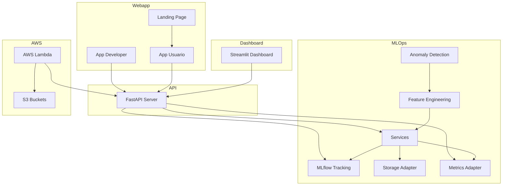
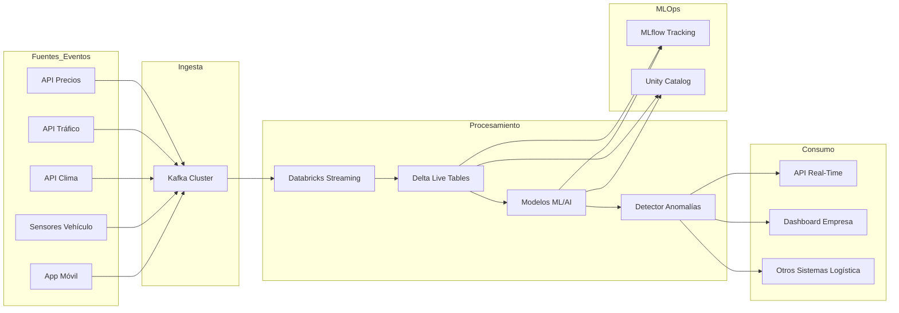

# UberH3 Anomaly Detection - Proyecto Integral

## 🚀 Descripción General
Este proyecto implementa un sistema completo para la detección de anomalías en la demanda de Uber NYC, abarcando desde el backend MLOps hasta el frontend web y la integración con AWS Lambda. Utiliza machine learning no supervisado (Isolation Forest), arquitectura hexagonal (Ports & Adapters), y prácticas modernas de despliegue y visualización.

---

## 🏛️ Arquitectura General
El sistema está dividido en varios componentes principales:
- **Backend MLOps**: Detección de anomalías, ingeniería de features, almacenamiento y tracking de modelos.
- **API REST**: Servidor FastAPI para exponer endpoints de predicción, métricas y salud.
- **Dashboard**: Visualización en tiempo real con Streamlit.
- **Webapp**: Frontend para usuarios finales, con landing page y dashboard interactivo.
- **AWS Lambda**: Backend serverless para integración y despliegue escalable.
- **Docker & CI/CD**: Contenerización y automatización de despliegue.

---

## 📦 Estructura de Carpetas
- `anomaly_detector/`: Núcleo de negocio, adaptadores, API y dashboard.
- `webapp/`: Frontend y backend para la aplicación de usuario y developer.
- `deployment/`: Dockerfiles, scripts de despliegue y configuración.
- `data/`: Datos crudos y procesados.
- `config/`: Configuración de features y modelos.

---

## 📐 Diagrama de Componentes (Mermaid)

---

## 🌐 Alcance de Arquitecturas
### Hexagonal & DDD
- **Dominio desacoplado**: Toda la lógica de negocio vive en `domain/`.
- **Adaptadores**: Implementan puertos para almacenamiento, tracking, métricas y API.
- **Aplicación**: Orquestación y exposición de endpoints.

### AWS & Lambda
- **Despliegue serverless**: Backend Python en AWS Lambda usando Docker.
- **Almacenamiento S3**: Conectores para leer y escribir datos en buckets S3.
- **Integración CI/CD**: Automatización de despliegue y monitoreo.

### Docker & DevOps
- **Contenerización**: Dockerfiles para API, dashboard y backend Lambda.
- **Orquestación**: Docker Compose para levantar todos los servicios localmente.
- **Scripts**: Batch y Bash para despliegue multiplataforma.

---

## 🖥️ Aplicación de Usuario
- **Landing Page**: Interfaz web amigable para acceso y visualización.
- **Dashboard**: Visualización de tendencias, anomalías y salud del sistema.
- **API REST**: Endpoints para predicción, métricas y consulta de modelos.

## 👨‍💻 Aplicación de Developers
- **Backend extensible**: Arquitectura hexagonal para fácil integración de nuevos adaptadores y servicios.
- **MLOps**: Tracking de experimentos, versionado de features y modelos.
- **Documentación**: Diagramas y guías en `docs/` y archivos fuente.

---

## 🛠️ Despliegue y Ejecución
1. **Instalar dependencias**: `pip install -r requirements.txt`
2. **Configurar parámetros**: Editar archivos YAML en `config/`.
3. **Levantar servicios**: Ejecutar `start-docker.bat` (Windows) o `start-docker.sh` (Linux/Mac).
4. **Acceder a servicios**:
   - FastAPI: [http://localhost:8000](http://localhost:8000)
   - Dashboard: [http://localhost:8506](http://localhost:8506)
   - MLflow UI: [http://localhost:5000](http://localhost:5000)
5. **Despliegue en AWS Lambda**: Usar Dockerfile específico y subir a AWS.

---

## 📚 Buenas Prácticas
- Lógica de negocio desacoplada y testeable.
- Versionado y auditoría de modelos y features.
- Seguridad y compliance en todos los componentes.
- Automatización CI/CD y monitoreo continuo.

---

## 📖 Referencias y Documentación
- Diagramas y detalles en `anomaly_detector/docs/`
- Guía rápida en `anomaly_detector/README.md`
- Documentación de backend y frontend en `webapp/`

---

Para dudas o contribuciones, revisa los archivos fuente y la documentación incluida en cada módulo.

---

## Buenos Hábitos de Desarrollo
- Mantener la rama principal (`main`) siempre funcional y documentada  
- Crear ramas para nuevas funcionalidades o experimentos y generar Pull Requests para revisión de código  
- Documentar cada módulo y función en el código fuente  
- Facilitar la reproducción de resultados agregando ejemplos de uso y muestras de datos en el README

---

## Escalabilidad
Adoptando arquitecturas modernas facilita alcanzar niveles de escalabilidad horizontal y vertical para mejorar la adaptación a diferentes tamaño de operaciones, desde pequeñas startups hasta operadores de gran magnitud en servicios de taxi por aplicativo en grandes ciudades. La estructura hexagonal permite a futuro la incorporación de nuevos algoritmos de detección, que incluyen métodos de aprendizaje profundo y técnicas de conjunto, sin alterar las operaciones ya establecidas, esto puede ser de utilidad para la integración con sistemas de Internet de las Cosas incorporarando datos obtenidos de sensores de tráfico, la conexión con sistemas de administración de flotas, y la adaptación a diferentes formas de transporte (bicicletas, motocicletas, transporte público). Esta capacidad de adaptación arquitectónica sitúa al sistema como un caso de uso robusto para la evolución continua de las necesidades de movilidad en la ciudad. 
En resumen, nuestro proyecto demuestra que la adopción de técnicas avanzadas de ML, el uso de estructuras arquitectónicas modernas y la adopción de métodos operacionales innovadores se pueden aplicar con éxito a un sector crucial como del de transporte de taxi por aplicación en urbes de tráfico masivo. La combinación sinérgica del algoritmo Isolation Forest, la estructura hexagonal, los fundamentos de DDD y las técnicas MLOps produce una solución integral que no solo atiende problemas técnicos específicos, sino que también establece un esquema de trabajo replicable para futuras innovaciones en sistemas de transporte inteligente. En resumen, podemos afirmar que la contribución principal se enfoca en demostrar que la integración detallada de estas tecnologías y metodologías puede producir sistemas de identificación de anomalías que al mismo tiempo son exactos, escalables, mantenibles y operativamente factibles para aplicaciones esenciales de transporte urbano en el entorno real, y que han sido desarrolladas en clase durante el semestre.

---

## Futuras Mejoras
- **Cambio a una arquitectura de big data y transmisión en tiempo real.**
  La posibilidad de escalar aplicaciones de ML hacia big data es fundamental; por tanto, la incorporación de soluciones que permitan gestionar voluminosas cantidades en tiempo real debe ser considerada. Apache Kafka es una solución de código abierto que permite manejar millones de eventos, ofreciendo habilidades para consumir datos con latencias menores a 100 ms. Una arquitectura sugerida abarcaría: productores Kafka incorporados en aplicativos móviles y sistemas en vehículos que puedan publicar eventos de localización, inicio/fin de viaje y métricas operativas; consumidores expertos que manejan flujo de datos para diversas situaciones de uso así como sistemas de almacenamiento distribuido utilizando tecnologías como Apache HDFS o Delta Lake.
- **Integración con Databricks**
  La incorporación de Databricks como plataforma unificada de análisis y aprendizaje automático significaría un avance cualitativo en las habilidades del sistema Databricks Structured Streaming (DSS) facilita el manejo de flujo de datos con latencias de cientos de milisegundos, habilitando la detección de anomalías en tiempo real. Elementos como Auto Loader para la automatización de la ingesta incremental desde fuentes de datos variables, Delta Live Tables (DLT) para la creación de líneas de datos declarativas que gestionan tanto datos en batch como en streaming, MLflow integrado para la administración integral del ciclo de vida de modelos, desde la experimentación hasta la implementación en producción, así como Unity Catalog para la gestión de datos y modelos a nivel corporativo.
- **Técnicas Avanzadas de Escalabilidad del Modelo**
  La evolución hacia arquitecturas de microservicios permitiría escalabilidad granular de diferentes componentes del sistema de detección de anomalías. La implementación de una arquitectura de microservicios ML permite el escalamiento independiente de servicios de ingreso de datos, procesamiento e inferencia según demanda específica. Como estrategias de escalabilidad tendríamos: escalamiento horizontal automático mediante Kubernetes Horizontal Pod Autoscaler (HPA) para manejar picos de demanda; escalamiento vertical dinámico usando Vertical Pod Autoscaler (VPA) para modelos que requieren recursos computacionales intensivos; distribución de carga inteligente mediante balanceadores que consideran la capacidad específica de cada instancia de modelo, así como optimización de runtime usando runtimes de alto rendimiento como TensorRT u ONNX Runtime para reducir latencias de inferencia.

---

## Arquitectura Futura: Kappa Streaming y MLOps
La siguiente arquitectura ilustra cómo el sistema puede evolucionar para recibir eventos en tiempo real desde múltiples fuentes, procesar datos con Databricks Streaming y MLOps, e integrar modelos adicionales (clima, precios, tráfico, etc.) para entregar valor logístico en tiempo real.

---

## Licencia y Contacto
- **Licencia:** Commons Clause + MIT / Apache 2.0
- **Equipo:**
  - [Jhonathan Pauca](mailto:jhonathan.pauca@unmsm.edu.pe), [jhonmetal](https://github.com/jhonmetal/)
  - [Fernando Flores](mailto:fernando.floresr@unmsm.edu.pe), [fnfloresra](https://github.com/fnfloresra)
  - [Melissa Rodriguez](mailto:melissa.rodriguezs@unmsm.edu.pe), [Melissadrrs](https://github.com/Melissadrrs)
  - [Heber Hualpa](mailto:heber.hualpa@unmsm.edu.pe), [hheber](https://github.com/hheber/)
  - [Marco Candia](mailto:marco.candia@unmsm.edu.pe)
