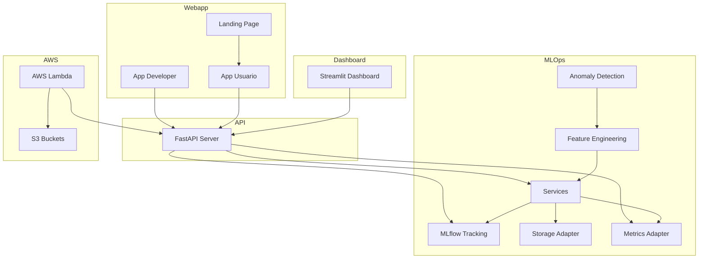

# UberH3 Anomaly Detection - Proyecto Integral

## 🚀 Descripción General
Este proyecto implementa un sistema completo para la detección de anomalías en la demanda de Uber NYC, abarcando desde el backend MLOps hasta el frontend web y la integración con AWS Lambda. Utiliza machine learning no supervisado (Isolation Forest), arquitectura hexagonal (Ports & Adapters), y prácticas modernas de despliegue y visualización.

---

## 🏛️ Arquitectura General
El sistema está dividido en varios componentes principales:
- **Backend MLOps**: Detección de anomalías, ingeniería de features, almacenamiento y tracking de modelos.
- **API REST**: Servidor FastAPI para exponer endpoints de predicción, métricas y salud.
- **Dashboard**: Visualización en tiempo real con Streamlit.
- **Webapp**: Frontend para usuarios finales, con landing page y dashboard interactivo.
- **AWS Lambda**: Backend serverless para integración y despliegue escalable.
- **Docker & CI/CD**: Contenerización y automatización de despliegue.

---

## 📦 Estructura de Carpetas
- `anomaly_detector/`: Núcleo de negocio, adaptadores, API y dashboard.
- `webapp/`: Frontend y backend para la aplicación de usuario y developer.
- `deployment/`: Dockerfiles, scripts de despliegue y configuración.
- `data/`: Datos crudos y procesados.
- `config/`: Configuración de features y modelos.

---

## 📐 Diagrama de Componentes (Mermaid)

---

## 🌐 Alcance de Arquitecturas
### Hexagonal & DDD
- **Dominio desacoplado**: Toda la lógica de negocio vive en `domain/`.
- **Adaptadores**: Implementan puertos para almacenamiento, tracking, métricas y API.
- **Aplicación**: Orquestación y exposición de endpoints.

### AWS & Lambda
- **Despliegue serverless**: Backend Python en AWS Lambda usando Docker.
- **Almacenamiento S3**: Conectores para leer y escribir datos en buckets S3.
- **Integración CI/CD**: Automatización de despliegue y monitoreo.

### Docker & DevOps
- **Contenerización**: Dockerfiles para API, dashboard y backend Lambda.
- **Orquestación**: Docker Compose para levantar todos los servicios localmente.
- **Scripts**: Batch y Bash para despliegue multiplataforma.

---

## 🖥️ Aplicación de Usuario
- **Landing Page**: Interfaz web amigable para acceso y visualización.
- **Dashboard**: Visualización de tendencias, anomalías y salud del sistema.
- **API REST**: Endpoints para predicción, métricas y consulta de modelos.

## 👨‍💻 Aplicación de Developers
- **Backend extensible**: Arquitectura hexagonal para fácil integración de nuevos adaptadores y servicios.
- **MLOps**: Tracking de experimentos, versionado de features y modelos.
- **Documentación**: Diagramas y guías en `docs/` y archivos fuente.

---

## 🛠️ Despliegue y Ejecución
1. **Instalar dependencias**: `pip install -r requirements.txt`
2. **Configurar parámetros**: Editar archivos YAML en `config/`.
3. **Levantar servicios**: Ejecutar `start-docker.bat` (Windows) o `start-docker.sh` (Linux/Mac).
4. **Acceder a servicios**:
   - FastAPI: [http://localhost:8000](http://localhost:8000)
   - Dashboard: [http://localhost:8506](http://localhost:8506)
   - MLflow UI: [http://localhost:5000](http://localhost:5000)
5. **Despliegue en AWS Lambda**: Usar Dockerfile específico y subir a AWS.

---

## 📚 Buenas Prácticas
- Lógica de negocio desacoplada y testeable.
- Versionado y auditoría de modelos y features.
- Seguridad y compliance en todos los componentes.
- Automatización CI/CD y monitoreo continuo.

---

## 📖 Referencias y Documentación
- Diagramas y detalles en `anomaly_detector/docs/`
- Guía rápida en `anomaly_detector/README.md`
- Documentación de backend y frontend en `webapp/`

---

Para dudas o contribuciones, revisa los archivos fuente y la documentación incluida en cada módulo.

---

## Buenos Hábitos de Desarrollo
- Mantener la rama principal (`main`) siempre funcional y documentada  
- Crear ramas para nuevas funcionalidades o experimentos y generar Pull Requests para revisión de código  
- Documentar cada módulo y función en el código fuente  
- Facilitar la reproducción de resultados agregando ejemplos de uso y muestras de datos en el README

---

## Licencia y Contacto
- **Licencia:** Commons Clause + MIT / Apache 2.0
- **Equipo:**
  - [Jhonathan Pauca](mailto:jhonathan.pauca@unmsm.edu.pe), [jhonmetal](https://github.com/jhonmetal/)
  - [Fernando Flores](mailto:fernando.floresr@unmsm.edu.pe), [fnfloresra](https://github.com/fnfloresra)
  - [Melissa Rodriguez](mailto:melissa.rodriguezs@unmsm.edu.pe), [Melissadrrs](https://github.com/Melissadrrs)
  - [Heber Hualpa](mailto:heber.hualpa@unmsm.edu.pe), [hheber](https://github.com/hheber/)
  - [Marco Candia](mailto:marco.candia@unmsm.edu.pe)
