# UberH3 Anomaly Detection - Proyecto Integral

## 🚀 Descripción General
Este proyecto implementa un sistema completo para la detección de anomalías en la demanda de Uber NYC, abarcando desde el backend MLOps hasta el frontend web y la integración con AWS Lambda. Utiliza machine learning no supervisado (Isolation Forest), arquitectura hexagonal (Ports & Adapters), y prácticas modernas de despliegue y visualización.

---

## 🏛️ Arquitectura General
El sistema está dividido en varios componentes principales:
- **Backend MLOps**: Detección de anomalías, ingeniería de features, almacenamiento y tracking de modelos.
- **API REST**: Servidor FastAPI para exponer endpoints de predicción, métricas y salud.
- **Dashboard**: Visualización en tiempo real con Streamlit.
- **Webapp**: Frontend para usuarios finales, con landing page y dashboard interactivo.
- **AWS Lambda**: Backend serverless para integración y despliegue escalable.
- **Docker & CI/CD**: Contenerización y automatización de despliegue.

---

## 📦 Estructura de Carpetas
- `anomaly_detector/`: Núcleo de negocio, adaptadores, API y dashboard.
- `webapp/`: Frontend y backend para la aplicación de usuario y developer.
- `deployment/`: Dockerfiles, scripts de despliegue y configuración.
- `data/`: Datos crudos y procesados.
- `config/`: Configuración de features y modelos.

---

## 📐 Diagrama de Componentes (Mermaid)

---

## 🌐 Alcance de Arquitecturas
### Hexagonal & DDD
- **Dominio desacoplado**: Toda la lógica de negocio vive en `domain/`.
- **Adaptadores**: Implementan puertos para almacenamiento, tracking, métricas y API.
- **Aplicación**: Orquestación y exposición de endpoints.

### AWS & Lambda
- **Despliegue serverless**: Backend Python en AWS Lambda usando Docker.
- **Almacenamiento S3**: Conectores para leer y escribir datos en buckets S3.
- **Integración CI/CD**: Automatización de despliegue y monitoreo.

### Docker & DevOps
- **Contenerización**: Dockerfiles para API, dashboard y backend Lambda.
- **Orquestación**: Docker Compose para levantar todos los servicios localmente.
- **Scripts**: Batch y Bash para despliegue multiplataforma.

---

## 🖥️ Aplicación de Usuario
- **Landing Page**: Interfaz web amigable para acceso y visualización.
- **Dashboard**: Visualización de tendencias, anomalías y salud del sistema.
- **API REST**: Endpoints para predicción, métricas y consulta de modelos.

## 👨‍💻 Aplicación de Developers
- **Backend extensible**: Arquitectura hexagonal para fácil integración de nuevos adaptadores y servicios.
- **MLOps**: Tracking de experimentos, versionado de features y modelos.
- **Documentación**: Diagramas y guías en `docs/` y archivos fuente.

---

## 🛠️ Despliegue y Ejecución
1. **Instalar dependencias**: `pip install -r requirements.txt`
2. **Configurar parámetros**: Editar archivos YAML en `config/`.
3. **Levantar servicios**: Ejecutar `start-docker.bat` (Windows) o `start-docker.sh` (Linux/Mac).
4. **Acceder a servicios**:
   - FastAPI: [http://localhost:8000](http://localhost:8000)
   - Dashboard: [http://localhost:8506](http://localhost:8506)
   - MLflow UI: [http://localhost:5000](http://localhost:5000)
5. **Despliegue en AWS Lambda**: Usar Dockerfile específico y subir a AWS.

---

## 📚 Buenas Prácticas
- Lógica de negocio desacoplada y testeable.
- Versionado y auditoría de modelos y features.
- Seguridad y compliance en todos los componentes.
- Automatización CI/CD y monitoreo continuo.

---

## 📖 Referencias y Documentación
- Diagramas y detalles en `anomaly_detector/docs/`
- Guía rápida en `anomaly_detector/README.md`
- Documentación de backend y frontend en `webapp/`

---

Para dudas o contribuciones, revisa los archivos fuente y la documentación incluida en cada módulo.

---

## 👨‍💻 Buenos Hábitos de Desarrollo
- Mantener la rama principal (`main`) siempre funcional y documentada  
- Crear ramas para nuevas funcionalidades o experimentos y generar Pull Requests para revisión de código  
- Documentar cada módulo y función en el código fuente  
- Facilitar la reproducción de resultados agregando ejemplos de uso y muestras de datos en el README

---

## 🚀 Escalabilidad: Crece con tu Negocio

¿Buscas una solución que acompañe el crecimiento de tu empresa, desde una startup hasta un operador líder en grandes ciudades? Nuestra plataforma está diseñada para escalar tanto horizontal como verticalmente, adaptándose a cualquier volumen de operaciones y permitiendo la integración de nuevas fuentes de datos y algoritmos de detección avanzada sin interrumpir el servicio.

**Ventajas clave para tu negocio:**

- **Expansión sin límites:** La arquitectura hexagonal permite incorporar fácilmente nuevos algoritmos de machine learning, incluyendo inteligencia artificial avanzada y técnicas de conjunto, para anticipar y detectar patrones de demanda y anomalías en tiempo real.
- **Integración IoT y movilidad:** Conecta sensores de tráfico, sistemas de administración de flotas y diferentes tipos de transporte (bicicletas, motos, transporte público) para una visión 360° de la movilidad urbana.
- **Adaptación continua:** El sistema evoluciona junto a las necesidades del mercado, permitiendo a tu empresa responder rápidamente a cambios en la demanda, optimizar recursos y mejorar la experiencia del usuario final.
- **Solución probada:** La combinación de algoritmos de vanguardia, arquitectura robusta y prácticas MLOps garantiza resultados exactos, escalables y mantenibles, listos para ser replicados en cualquier ciudad o contexto de movilidad.

En resumen, nuestra solución no solo resuelve desafíos técnicos, sino que impulsa la innovación y el crecimiento sostenible de tu negocio en el sector de transporte inteligente.

---

## 🌟 Futuras Mejoras: Innovación Continua para tu Empresa

¿Quieres ir más allá? Estas son las próximas fronteras que potenciarán aún más el valor de tu operación:

### 1. Big Data y Streaming en Tiempo Real
Imagina procesar millones de eventos por segundo, provenientes de apps móviles, vehículos y sensores urbanos. Con tecnologías como **Apache Kafka**, tu empresa podrá anticipar tendencias y responder a cambios en la demanda con latencias menores a 100 ms. Esto significa menos viajes perdidos, mayor eficiencia y clientes más satisfechos.

### 2. Integración con Databricks y Analítica Avanzada
La unión con **Databricks** permitirá análisis predictivo y aprendizaje automático en tiempo real. Gracias a herramientas como **Structured Streaming**, **Delta Live Tables** y **MLflow**, tu equipo podrá automatizar la ingesta, el procesamiento y la gestión de modelos, asegurando resultados confiables y auditables a escala corporativa.

### 3. Microservicios y Escalabilidad Inteligente
La arquitectura de microservicios ML permitirá escalar cada componente según la demanda, optimizando recursos y costos. Con Kubernetes y balanceadores inteligentes, tu operación estará siempre lista para los picos de demanda, manteniendo la calidad del servicio y la velocidad de respuesta.

**¿El resultado?** Una plataforma lista para el futuro, capaz de integrar nuevas fuentes de datos (clima, precios, tráfico), adaptarse a cualquier ciudad y ofrecer valor logístico en tiempo real a empresas líderes del sector.

---

## 🌐 Arquitectura Futura: Kappa Streaming y MLOps
La siguiente arquitectura ilustra cómo el sistema puede evolucionar para recibir eventos en tiempo real desde múltiples fuentes, procesar datos con Databricks Streaming y MLOps, e integrar modelos adicionales (clima, precios, tráfico, etc.) para entregar valor logístico en tiempo real.

```mermaid
flowchart LR
    subgraph Fuentes_Eventos
        MOVIL[App Móvil]
        VEHICULO[Sensores Vehículo]
        CLIMA[API Clima]
        TRAFICO[API Tráfico]
        PRECIOS[API Precios]
    end
    subgraph Ingesta
        KAFKA[Kafka Cluster]
    end
    subgraph Procesamiento
        DATABRICKS[Databricks Streaming]
        DLT[Delta Live Tables]
        ML_MODELS[Modelos ML/AI]
        ANOMALY[Detector Anomalías]
    end
    subgraph MLOps
        MLflow[MLflow Tracking]
        Unity[Unity Catalog]
    end
    subgraph Consumo
        API_REALTIME[API Real-Time]
        DASH_EMPRESA[Dashboard Empresa]
        SISTEMAS[Otros Sistemas Logística]
    end
    MOVIL --> KAFKA
    VEHICULO --> KAFKA
    CLIMA --> KAFKA
    TRAFICO --> KAFKA
    PRECIOS --> KAFKA
    KAFKA --> DATABRICKS
    DATABRICKS --> DLT
    DLT --> ML_MODELS
    ML_MODELS --> ANOMALY
    ANOMALY --> API_REALTIME
    ANOMALY --> DASH_EMPRESA
    ANOMALY --> SISTEMAS
    ML_MODELS --> MLflow
    ML_MODELS --> Unity
    DLT --> MLflow
    DLT --> Unity
```

---

## Licencia y Contacto
- **Licencia:** Commons Clause + MIT / Apache 2.0
- **Equipo:**
  - [Jhonathan Pauca](mailto:jhonathan.pauca@unmsm.edu.pe), [jhonmetal](https://github.com/jhonmetal/)
  - [Fernando Flores](mailto:fernando.floresr@unmsm.edu.pe), [fnfloresra](https://github.com/fnfloresra)
  - [Melissa Rodriguez](mailto:melissa.rodriguezs@unmsm.edu.pe), [Melissadrrs](https://github.com/Melissadrrs)
  - [Heber Hualpa](mailto:heber.hualpa@unmsm.edu.pe), [hheber](https://github.com/hheber/)
  - [Marco Candia](mailto:marco.candia@unmsm.edu.pe)
