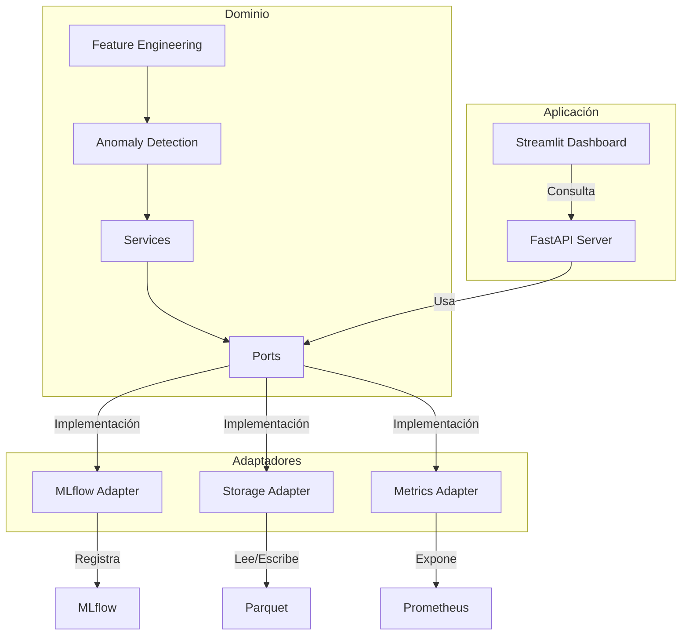

# Detección de Anomalías en la Demanda de Uber NYC

## Descripción General
Este repositorio implementa un sistema avanzado para detectar comportamientos atípicos en la demanda de viajes Uber en la ciudad de Nueva York. Utiliza técnicas de machine learning no supervisado (Isolation Forest) y una arquitectura hexagonal (Ports & Adapters) basada en DDD (Domain-Driven Design) para garantizar escalabilidad, mantenibilidad y despliegue seguro.

---

## 🏛️ Arquitectura Hexagonal & DDD
La arquitectura hexagonal separa el núcleo de negocio (dominio) de las dependencias externas (adaptadores), permitiendo que el sistema sea fácilmente extensible y testeable. DDD asegura que toda la lógica de negocio esté centralizada y desacoplada de la infraestructura.

**Componentes principales:**
- **Dominio (`domain/`)**: Lógica pura de negocio, sin dependencias externas. Incluye ingeniería de features, detección de anomalías, modelos y puertos (interfaces).
- **Adaptadores (`adapters/`)**: Implementan los puertos definidos en el dominio para interactuar con almacenamiento, MLflow, API, métricas, etc.
- **Contratos (`contracts/`)**: Esquemas Protobuf para contratos entre servicios, versionados.
- **Aplicación (`application/`)**: Orquestación, puertos de API y servidor FastAPI.
- **Configuración (`configs/`)**: Archivos YAML para hiperparámetros, capas de parquet y registro de features.
- **Dashboard (`streamlit_dashboard/`)**: Visualización en tiempo real con Streamlit.
- **Documentación (`docs/`)**: Diagramas, arquitectura y diseño DDD.

### Diagrama de Flujo (Mermaid)


---

## 📁 Estructura de Carpetas
- `domain/`: Lógica de negocio, ingeniería de features, detección de anomalías, modelos y puertos.
- `adapters/`: Implementaciones de almacenamiento, MLflow, API, métricas.
- `contracts/`: Esquemas Protobuf para contratos entre servicios.
- `application/`: Orquestación, puertos de API, servidor FastAPI.
- `configs/`: Archivos YAML para configuración y registro de features.
- `streamlit_dashboard/`: Dashboard en tiempo real con Streamlit.
- `docs/`: Documentación y diagramas de arquitectura.

---

## 🚦 Flujo de Componentes y Features
1. **Ingesta y Preprocesamiento**
   - Carga datos crudos de Uber NYC.
   - Limpieza y validación de campos (timestamps, GPS).
   - Indexación espacial con H3.
   - Agregación horaria y enriquecimiento con metadatos de vecindario.
2. **Ingeniería de Features**
   - Cálculo de features temporales, lags y estadísticas rolling.
   - Registro y versionado de features en YAML.
3. **Entrenamiento y Tracking**
   - Entrenamiento de modelos con Isolation Forest.
   - Tracking de experimentos y artefactos con MLflow.
   - Etiquetado heurístico para evaluación.
4. **Almacenamiento y Capas Parquet**
   - Capas bronze, silver y gold en formato parquet, particionadas.
   - Adaptadores implementan puertos para leer/escribir/listar/upload.
   - Cumplimiento de políticas de seguridad y compliance.
5. **API REST y Servidor**
   - FastAPI expone endpoints: `/batch_predict`, `/health`, `/model-info`, `/metrics`, `/performance-trends`, `/docs`.
   - JWT auth, circuit breaker y rate limiter.
   - Todos los esquemas de request/response definidos en `domain/models.py`.
6. **Dashboard en Tiempo Real**
   - Streamlit visualiza métricas, tendencias y salud de la API.
   - Tabs: heatmap, performance trends, API health.
   - Métricas instrumentadas vía Prometheus.
7. **Despliegue y Contenerización**
   - Dockerfiles multi-stage para API y dashboard.
   - Orquestación con `docker-compose.yml`.
   - Políticas de seguridad: no root, escaneo Trivy, IAM least-privilege.
8. **CI/CD Automatizado**
   - Workflows de GitHub Actions para testing, validación, build, despliegue y monitoreo.
   - Validación de políticas, contratos protobuf y cobertura ≥ 90%.
   - Issues automáticos en violaciones de políticas.
9. **Documentación como Código**
   - Diagrama hexagonal y DDD en `docs/`.
   - Health checks, métricas y logs para observabilidad.
   - Actualización automática de docs en GitHub Pages.

---

## 🛠️ Guía de Inicio Rápido
1. **Instalar dependencias**
   ```bash
   pip install -r requirements.txt
   ```
2. **Configurar hiperparámetros y features**
   - Edita `configs/train.yaml` para ajustar parámetros del modelo y experimentos.
   - Revisa y versiona features en `configs/feature_registry.yaml`.
3. **Ejecutar el pipeline de entrenamiento**
   - Ejecuta el pipeline desde `domain/services.py`:
     ```python
     from anomaly_detector.domain.services import run_pipeline
     # Carga tu DataFrame y llama run_pipeline(df)
     ```
   - O inicia el servidor FastAPI:
     ```bash
     uvicorn anomaly_detector.application.fastapi_server:app --reload
     ```
4. **Monitorear y visualizar resultados**
   - Inicia el dashboard:
     ```bash
     streamlit run anomaly_detector/streamlit_dashboard/dashboard.py
     ```
   - Accede a tabs de heatmap, tendencias y salud de API.
5. **Desplegar en contenedores**
   - Construye y levanta servicios con Docker Compose:
     ```bash
     cd deployment
     docker-compose up --build
     ```
   - Revisa logs y métricas en tiempo real.
6. **Automatizar CI/CD**
   - Los workflows de GitHub Actions validan código, entrenan modelos, despliegan y monitorean.
   - No se permite merge hasta pasar todos los checks de seguridad y políticas.

---

## 📚 Políticas y Buenas Prácticas
- Toda la lógica de negocio vive en `domain/` sin dependencias externas.
- Los adaptadores implementan puertos definidos en `domain/ports.py`.
- Todos los esquemas y features están versionados y registrados.
- Seguridad, CI/CD y compliance se aplican vía GitHub Actions y escaneo automático.
- Documentación y diagramas siempre actualizados en PRs.

---

## ✅ Criterios de Aceptación
- Cero violaciones OPA/Conftest.
- Terraform validate & plan sin errores.
- CI en verde: tests, escaneos, verificación de capas y contratos protobuf.
- API cumple SLOs definidos.
- Documentación y diagramas hexagonales/DDD actualizados y publicados.

---

## Buenos Hábitos de Desarrollo
- Mantener la rama principal (`main`) siempre funcional y documentada  
- Crear ramas para nuevas funcionalidades o experimentos y generar Pull Requests para revisión de código  
- Documentar cada módulo y función en el código fuente  
- Facilitar la reproducción de resultados agregando ejemplos de uso y muestras de datos en el README

---

## Licencia y Contacto
- **Licencia:** Commons Clause + MIT / Apache 2.0
- **Equipo:**
  - [Jhonathan Pauca](mailto:jhonathan.pauca@unmsm.edu.pe), [jhonmetal](https://github.com/jhonmetal/)
  - [Fernando Flores](mailto:fernando.floresr@unmsm.edu.pe), [fnfloresra](https://github.com/fnfloresra)
  - [Melissa Rodriguez](mailto:melissa.rodriguezs@unmsm.edu.pe), [Melissadrrs](https://github.com/Melissadrrs)
  - [Heber Hualpa](mailto:heber.hualpa@unmsm.edu.pe), [hheber](https://github.com/hheber/)
  - [Marco Candia](mailto:marco.candia@unmsm.edu.pe)

> Este README servirá como base para futuras ampliaciones, incorporando descripciones detalladas de cada componente, ejemplos de ejecución con resultados esperados y enlaces a dashboards de visualización de métricas.
