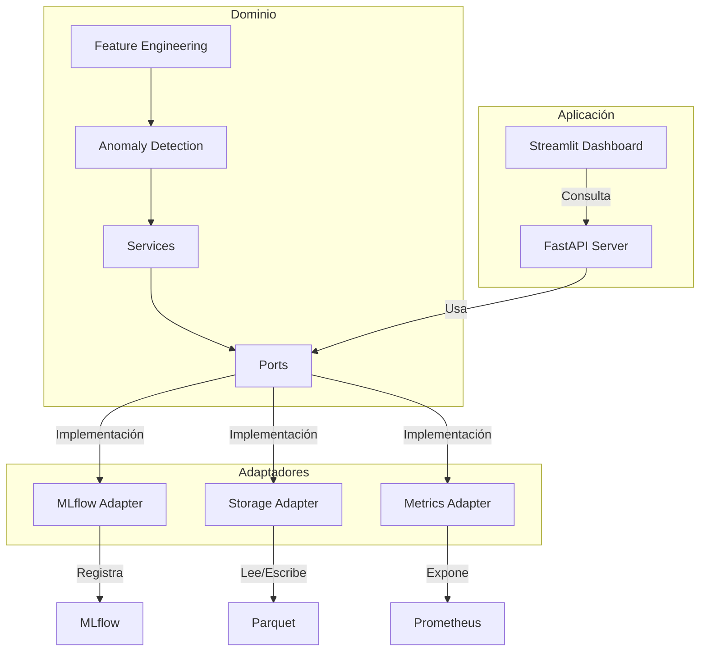
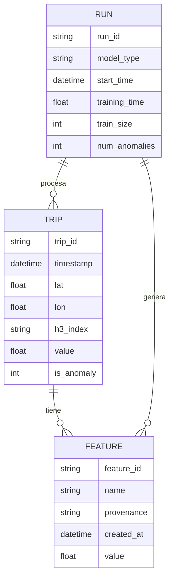

# Documentación de Arquitectura y Diseño

## 📐 Arquitectura Hexagonal (Ports & Adapters)
La arquitectura hexagonal separa el núcleo de negocio (dominio) de las dependencias externas, permitiendo que el sistema sea fácilmente extensible, testeable y desacoplado.

### Diagrama Mermaid: Hexagonal

---

## 🏛️ Domain-Driven Design (DDD)
- **Entidad principal:** Viaje Uber (Trip)
- **Agregado:** Detección de anomalías sobre agregados horarios y espaciales
- **Servicios de dominio:** Ingeniería de features, agregación, detección, visualización
- **Puertos:** Interfaces para almacenamiento, tracking, métricas, API
- **Adaptadores:** Implementaciones concretas para cada puerto

---

## 📊 Diagrama ER (Entidad-Relación)

---

## 📝 Notas de Diseño
- Todos los modelos y features están versionados y auditados.
- Los artefactos y métricas se registran en MLflow.
- El dashboard consulta la API para obtener tendencias y salud del sistema.
- La seguridad y compliance se aplican en todos los componentes.

---

Para más detalles, consulta los diagramas y documentación en este folder y en los archivos fuente del repositorio.
